# IgniteX.ai ERP — Knowledge Transfer

A jewellery-manufacturing ERP: masters and bills of material for gold, stone and finding items;
customer pricing struck against a daily metal rate; sales and purchase documents that move through a
configurable approval workflow; and a stock ledger that only ever moves because a document was
approved. **Every flow in the system, traced from the source and drawn.**

Where this document and the code disagree, the code is right — and this document is wrong and should
be corrected. `LOCAL_SETUP.md` is the authoritative setup guide; `README.md`'s API reference is known
stale (§30).

| | |
|---|---|
| **Stack** | Express + TypeScript + PostgreSQL · React + Vite + Redux Toolkit + Tailwind |
| **Scale** | ~16k lines API · ~55k lines app · 63 Prisma models |
| **Surveyed** | branch `feature/an-code-review` |
| **Figures** | 27 |

---

## Contents

**Part I — Platform**
1. [Orientation & topology](#1-orientation--topology)
2. [Repository map](#2-repository-map)
3. [Startup & bootstrap](#3-startup--bootstrap)
4. [Building the database](#4-building-the-database)
5. [The request pipeline](#5-the-request-pipeline)
6. [Three data-access styles](#6-three-data-access-styles)

**Part II — Identity**

7. [Login & session](#7-login--session)
8. [Password reset](#8-password-reset)
9. [User onboarding](#9-user-onboarding)
10. [Permission model](#10-permission-model)
11. [Permission administration & cache](#11-permission-administration--cache)
12. [Navigation & the tab system](#12-navigation--the-tab-system)

**Part III — Master data**

13. [Domain model](#13-domain-model)
14. [Item → variant → BOM](#14-item--variant--bom)
15. [BOM lifecycle & RFC versioning](#15-bom-lifecycle--rfc-versioning)
16. [Bulk import](#16-bulk-import)
17. [Lookups & LOVs](#17-lookups--lovs)
18. [Party masters](#18-party-masters)
19. [Daily Rate](#19-daily-rate)

**Part IV — Transactions**

20. [The workflow engine](#20-the-workflow-engine)
21. [Sales Order](#21-sales-order)
22. [Requisition → Purchase Order](#22-requisition--purchase-order)
23. [Metal Receipt → stock](#23-metal-receipt--stock)
24. [Stock posting](#24-stock-posting)

**Part V — Operations**

25. [Logging, mail & cache](#25-logging-mail--cache)
26. [Schema history](#26-schema-history)
27. [Deployment](#27-deployment)
28. [Recipe: adding a screen end to end](#28-recipe-adding-a-screen-end-to-end)
29. [Traps](#29-traps)
30. [Gaps & where risk sits](#30-gaps--where-risk-sits)

---

# Part I — Platform

## 1. Orientation & topology

The product manages the life of a jewellery item from design through manufacture to dispatch. Its
vocabulary is the trade's: a **design** becomes an **item**, an item has **variants** (a SKU per
karat colour / size / weight band), and a variant has a **BOM** listing the metal, stones, findings
and components that go into it. Weight is the unit of account — gross, net, pure, stone carats — and
metal is priced daily.

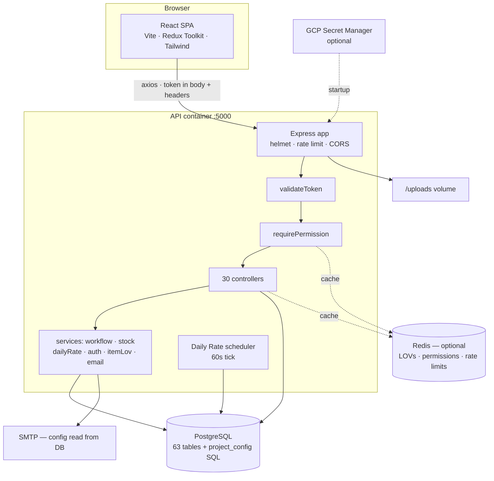
*Fig 1 — System topology. Redis, GCP Secret Manager and SMTP are all optional; each degrades rather
than fails.*

Two things about this codebase are unusual enough that they explain most of its shape: **a large
share of the application's SQL lives in a database table, not in the source tree** (§6), and **the
menu tree in the database is the unit of both navigation and permission** (§10). Neither is optional
knowledge — you cannot add a working screen without both.

---

## 2. Repository map

### Backend — `api/src/`

| Path | What lives there |
|---|---|
| `app.ts` | Thin bootstrap: `await loadSecretsFromGCP()`, then `await import('./server')`. The dynamic import is deliberate (§3). |
| `server.ts` | The real Express app — security middleware, body parsers, static `/uploads`, route mounting, health check, startup with DB retry. |
| `routes/` | One router per module; `index.ts` mounts all 30. Each line carries `validateToken` and usually `requirePermission(MENU, action)`. |
| `controllers/` | 30 files. Largest: production masters (1,028), purchase order (891), sales order (864). |
| `services/` | Logic shared by more than one controller: `workflow`, `stock`, `auth`, `dailyRate` + scheduler, `itemLov`, `email`. |
| `repository/` | Only `dynamic.repository.ts` — runs SQL fetched from `project_config`. |
| `middleware/` | `auth` (JWT + DB session), `permission` (menu gate), `validate` (Zod), `error` (logger, handler, 404). |
| `database/` | `connection.ts` (raw `pg` pool) and `prisma.ts` (Prisma singleton). Both live — see §6. |
| `constants/` | `bomWorkflow`, `orderWorkflow`, `auditModules`. |
| `utils/` | `response`, `audit`, `logger`, `redisClient`, `permissionCache`, `queryConfig`, `secrets`, `retry`. |

### Frontend — `app/src/`

| Path | What lives there |
|---|---|
| `api/apiService.ts` | The one axios instance — token injection, global loading counter, 401 redirect. Exports `dynamicApi` and `getFileUrl`. |
| `routes/AppRoutes.tsx` | URL → page, plus the `ProtectedRoute`/`PublicRoute` guards. |
| `routes/routeRegistry.ts` | Path → lazy component for the keep-alive tab system. **Every page appears in both files.** |
| `layouts/AdminLayout.tsx` | The signed-in shell: sidebar, navbar, tab bar, keep-alive rendering, loading overlay, toaster. |
| `pages/` | One folder per module. FG Item and Finding Master are ~3,200 lines each. |
| `components/` | `common/` (DataTable, Modal, dialogs), `layout/` (Sidebar, Navbar, TabBar), `workflow/WorkflowPanel`, `masters/` import wizards. |
| `redux/slices/` | `auth`, `menu`, `tabs`, `theme`, `notification`, `appConfig`, `loading`. |
| `utils/lovCache.ts` | Session-lifetime lookup cache with in-flight de-duplication. |

> **Convention.** `app/` is written **without** semicolons; `api/` **with** them. `.prettierrc`
> encodes both. Import through the `@/` alias, not long relative paths.

---

## 3. Startup & bootstrap

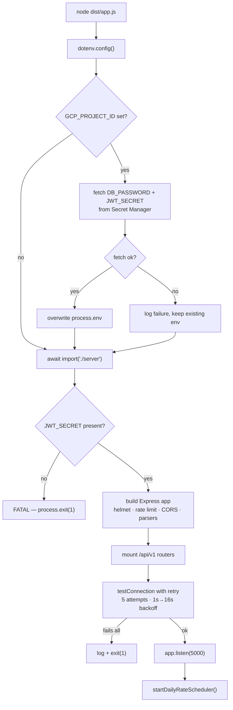
*Fig 2 — Startup. The dynamic import at step F is the whole reason `app.ts` and `server.ts` are
separate files.*

ES imports are hoisted above a module's own code, so a static `import './server'` in `app.ts` would
run — creating the Postgres pool and evaluating the `JWT_SECRET` check — *before* the secret fetch
had a chance to complete. The dynamic import defers it.

The connection retry exists because in Docker Compose the API container can be ready before Postgres
accepts connections. Once running, unhandled promise rejections are logged but do not kill the
process; `SIGTERM` exits cleanly.

---

## 4. Building the database

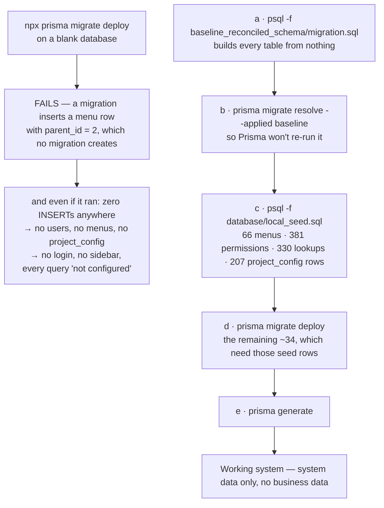
*Fig 3 — Database bootstrap. The seed sits between the baseline and the remaining migrations; that
ordering is not optional.*

```bash
psql -U postgres -c "CREATE DATABASE ignitex_erp;"
cd api
psql -U postgres -d ignitex_erp \
  -f prisma/migrations/20260716000001_baseline_reconciled_schema/migration.sql
npx prisma migrate resolve --applied 20260716000001_baseline_reconciled_schema
psql -U postgres -d ignitex_erp -f ../database/local_seed.sql
npx prisma migrate deploy
npx prisma generate
```

### Environment files

| File | Read by | Note |
|---|---|---|
| `api/.env.local` | The running API | `npm run dev` loads it explicitly via `dotenv_config_path`. |
| `api/.env` | The Prisma CLI only | `prisma.config.ts` loads plain `dotenv/config`, which reads `.env`. `DATABASE_URL` must match or migrations hit a different database than the app. |
| `app/.env` | Vite | Copy from `.env.example`; defaults work locally. |

Redis is not required locally. `JWT_SECRET` *is* — the server refuses to start without it. Sign in
with the **employee ID** (`EMP001` / `Admin@123`), not the email.

> **Trap.** Typing a page URL into the address bar redirects you home — `AdminLayout` bounces any
> route with no open tab (§12). Open pages by clicking them in the sidebar.

---

## 5. The request pipeline

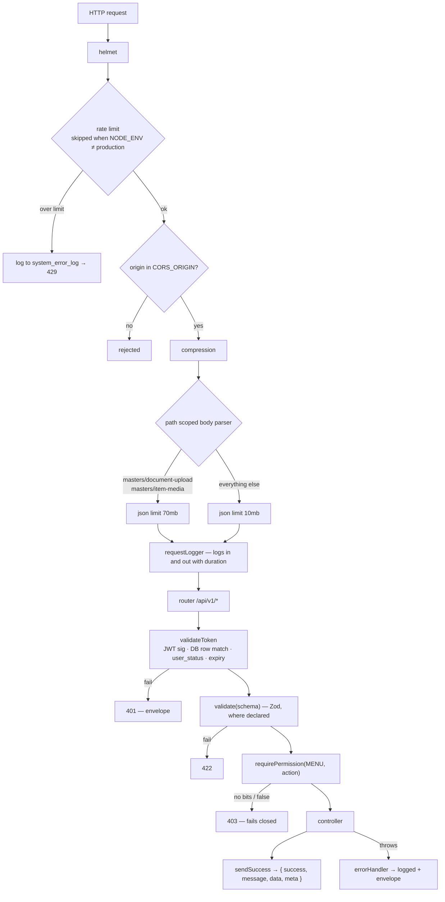
*Fig 4 — Middleware chain.*

**Every response goes through the envelope.** `sendSuccess` also runs `sanitizeBigInt`, which
recursively converts PostgreSQL `bigint`/`COUNT(*)` (returned by Prisma as JavaScript `BigInt`,
which `JSON.stringify` throws on) to `Number`, and `Prisma.Decimal` (which would otherwise serialise
as its internal `{s,e,d}` shape) to a string. Bypassing the helper with a raw `res.json()`
reintroduces both bugs.

Error detail is attached *only* when `NODE_ENV === 'development'`.

---

## 6. Three data-access styles

Three distinct ways of getting SQL to the database, layered in historically, all three live.

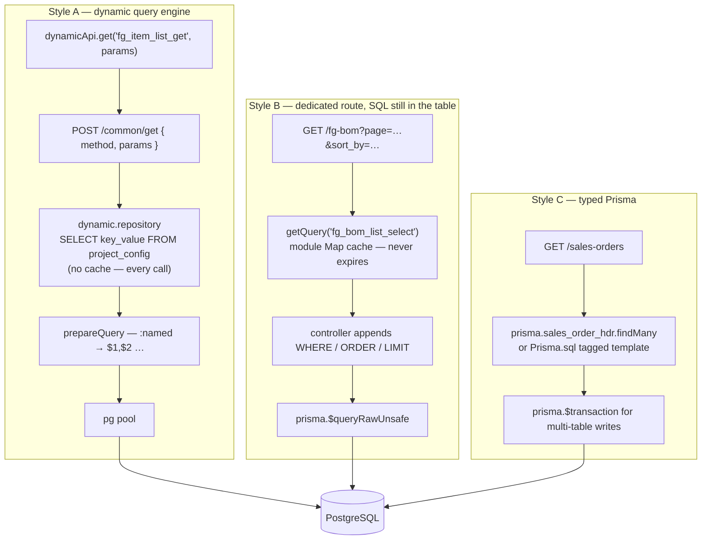
*Fig 5 — Style A re-reads its template every call; Style B caches indefinitely and must be flushed;
Style C has no template at all.*

### Style A — the dynamic query engine

SQL text lives in `project_config` keyed by `key_code`; the frontend names a *method* rather than an
endpoint.

| Endpoint | Verb | Purpose |
|---|---|---|
| `/common/get` | POST | SELECT, with optional pagination |
| `/common/post` | POST | INSERT — 201 only when a row actually came back |
| `/common/put` | PUT | UPDATE |
| `/common/delete/:id?` | DELETE | Soft delete |
| `/common/execute` | POST | Anything else configured |
| `/common/lookup/:type` | GET | Dropdown values from `master_lookup` |
| `/common/dashboard-stats` | GET | Home KPIs + the metal rate strip |

**Pagination is convention-driven.** Send `page` and `limit` and `commonGet` automatically looks for
a companion row named `<method>_count`. With no `_count` row, `total` silently falls back to the row
count of the page you just fetched — a paginator that always claims one page.

> **Why it is not an injection hole.** The `method` name is only a key lookup — it never reaches SQL.
> The SQL text is server-owned data only an administrator can write. User values arrive as `:named`
> parameters bound positionally through `pg`'s parameterised protocol. Note `sanitizeParam`
> deliberately does *not* strip characters from strings: blocklisting quotes and hyphens added no
> safety on top of parameter binding and silently corrupted legitimate values like `PO-000001`.

### Style B

Used by `fgBom`, `finBom`, `componentItem`, both import controllers and `settings`. Because
`getQuery()`'s cache never expires, an administrator editing `project_config` must flush it:
`POST /api/v1/settings/query-cache/flush`.

### Style C

Sales Order, Purchase Order, Purchase Requisition, Metal Receipt, Stock, Workflow,
Customer/Supplier Master, Customer Price, Daily Rate. New work should use this.

| | Raw `pg` pool | Prisma |
|---|---|---|
| Module | `database/connection.ts` | `database/prisma.ts` |
| Used by | Dynamic repository, auth service, audit/error logging, mail config | Every Style B and C controller, workflow, stock |
| Transactions | `executeTransaction(cb)` | `prisma.$transaction(tx => …)` |
| Config source | Discrete `DB_*` env vars | Also the discrete `DB_*` vars, via `PrismaPg` adapter — **not** `DATABASE_URL` |

> **Trap.** The two clients hold **separate connection pools**. A `prisma.$transaction` and an
> `executeTransaction` cannot participate in the same atomic unit.

---

# Part II — Identity

## 7. Login & session

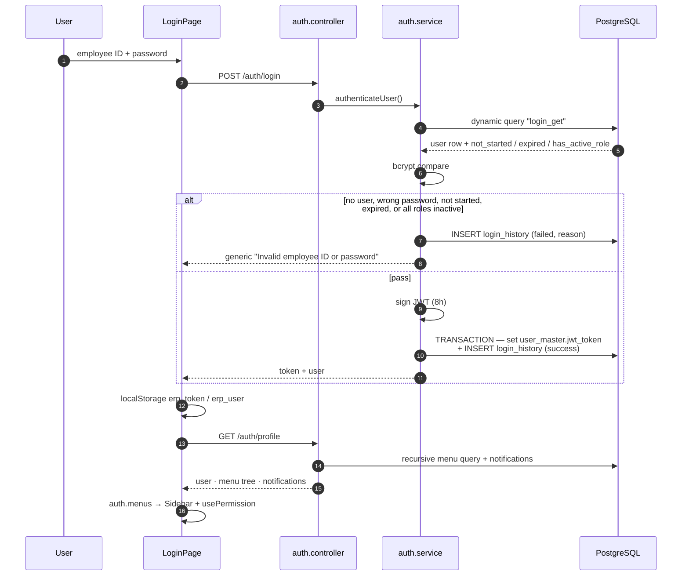
*Fig 6 — Login. The JWT is stored on the user row, which makes it a session token as much as a
bearer token.*

**The token is only valid while it matches the one on the user's row.** That single decision
produces four behaviours:

- **Single session** — a second login invalidates the first.
- **Real logout** — nulls `jwt_token` server-side; a copied token dies immediately, not at expiry.
- **Instant deactivation** — `user_status = false` takes effect on the next request.
- **Reset kicks everyone** — password reset also nulls the token.

`validateToken` accepts the token from the request body (`token`), `Authorization: Bearer`, or
`x-auth-token`; the axios interceptor sends all three. On 401 the interceptor clears storage and
hard-redirects to `/login`.

> **Documentation drift.** `README.md` describes an `api_key` field (`"ERP2026"`) on every request
> and lists the common endpoints as `GET`. Neither is true: `api_key`/`API_KEY` appears nowhere in
> `api/src`, and the common routes are `POST`/`PUT`/`DELETE`.

---

## 8. Password reset

```mermaid
sequenceDiagram
    autonumber
    participant U as User
    participant FE as ForgotPasswordPage
    participant API as auth.controller
    participant DB as user_master
    participant M as SMTP

    U->>FE: employee ID
    FE->>API: POST /auth/forgot-password
    API->>DB: look up employee_id
    alt not found or no email
        API-->>FE: "If the Employee ID exists, an OTP has been sent"<br/>(identical to success — blocks user enumeration)
    else found
        API->>API: 6-digit OTP, bcrypt-hashed
        API->>DB: store reset_otp_hash + expiry (15 min),<br/>reset attempts to 0, clear any reset_token
        API->>M: send OTP email
        API-->>FE: masked email + validity
    end

    U->>FE: OTP
    FE->>API: POST /auth/verify-otp
    API->>DB: read hash, expiry, attempt count
    alt attempts >= max (3)
        API-->>FE: "Too many failed attempts — request a new OTP"
    else expired
        API-->>FE: "OTP has expired"
    else wrong
        API->>DB: reset_otp_attempts + 1
        API-->>FE: "Invalid OTP. N attempts remaining."
    else correct
        API->>DB: clear OTP, store UUID reset_token + 10 min expiry
        API-->>FE: resetToken
    end

    U->>FE: new password
    FE->>API: POST /auth/reset-password { resetToken }
    API->>DB: verify token + expiry
    API->>DB: set password_hash; clear OTP + token;<br/>NULL jwt_token — every session dies
    API-->>FE: "Password reset successfully. Please log in."
```
*Fig 7 — Two short-lived secrets: an OTP that proves email control, exchanged for a token that
authorises exactly one password write.*

---

## 9. User onboarding

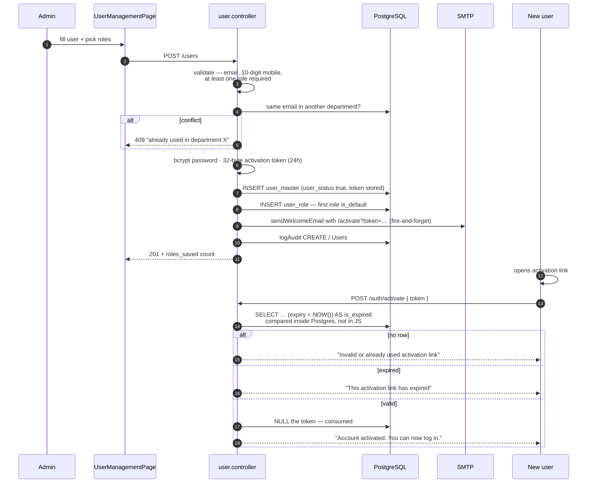
*Fig 8 — The expiry comparison happens inside Postgres because the column is `TIMESTAMP WITHOUT TIME
ZONE` and the session TZ is Asia/Kolkata — a JS comparison would be off by the IST offset.*

The welcome email is fire-and-forget: an SMTP failure logs a warning but never fails user creation.
Mail credentials come from the database (§25), not from environment variables.

---

## 10. Permission model

There are no permission strings like `"salesorder.create"`. The unit of permission is a row in
`menu_master`, identified by its `menu_code`, carrying six booleans: `can_view`, `can_create`,
`can_update`, `can_delete`, `can_print`, `can_export`.

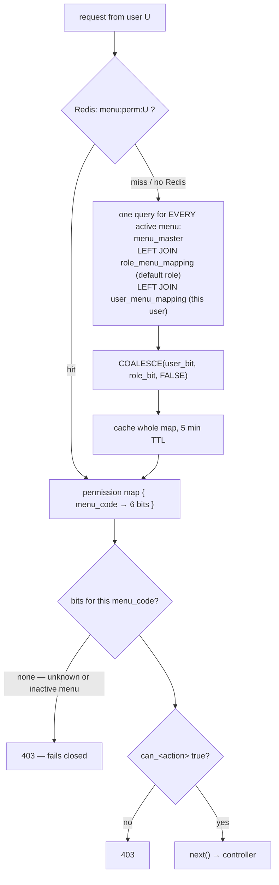
*Fig 9 — One query loads every menu's bits, not one query per check; this runs on every protected
request.*

The override is genuinely tri-state: `NULL` means "inherit the role", `true` and `false` both mean
"ignore the role".

Client-side, `usePermission(menuCode)` walks the menu tree loaded at `/auth/profile` and returns the
same six flags, used to hide buttons. That is presentation only. Calling `usePermission()` with no
argument returns all-true — an admin convenience worth knowing before you rely on it.

> **Trap — the two defaults disagree.** The sidebar query in `getUserMenus` resolves visibility as
> `COALESCE(umm.can_view, rm.can_view, TRUE)`, while `requirePermission` resolves as
> `COALESCE(umm.can_view, rm.can_view, FALSE)`. A menu with *no* `role_menu_mapping` row therefore
> **appears in the sidebar for everyone but 403s the moment the page calls its API**.

Three endpoints deliberately skip `requirePermission`: `GET /settings/erp` (so the login page can
load branding before anyone is signed in), and the workflow engine's `/panel`, `/access` and
`/action` — those are called from inside every workflow-enabled module's page, and action execution
is already gated by the engine's own per-step role/user assignment.

---

## 11. Permission administration & cache

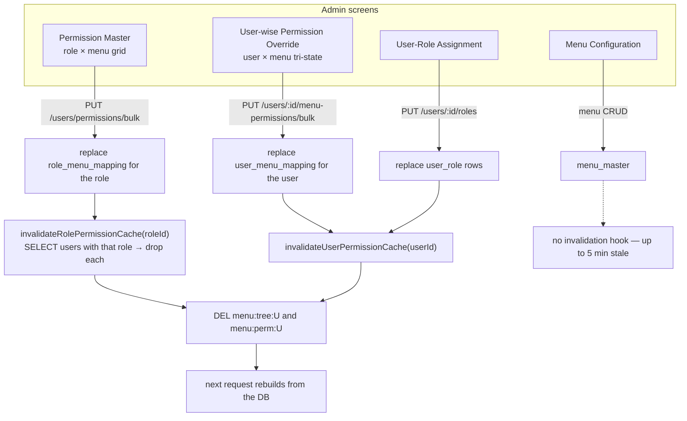
*Fig 10 — A role change fans out to every user holding that role.*

Both cache keys — `menu:tree:<userId>` (the sidebar) and `menu:perm:<userId>` (the enforcement map)
— derive from the same two tables, so they are always invalidated together. TTL is 5 minutes. A
permission change that skips the invalidation call takes up to that long to appear, which is the
usual explanation for "I gave them access and nothing happened."

---

## 12. Navigation & the tab system

The app is a tabbed workspace, not a page-per-URL SPA. `AdminLayout` renders **every open tab's
component simultaneously**, hiding inactive ones with `display: none`.

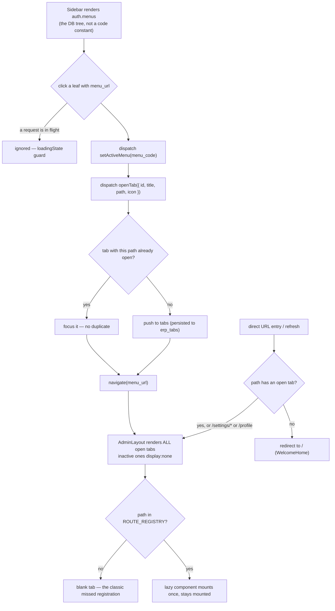
*Fig 11 — Three of this system's most common confusions all originate here.*

1. **Routing is declared twice** — `AppRoutes.tsx` *and* `routeRegistry.ts`.
2. **Deep links do not work** except for `/settings/*` and `/profile`.
3. **Mounted-but-hidden pages still run.** Intervals and effect loops in a background tab keep
   executing. Clean them up.

### State

| Slice | Holds | Persistence |
|---|---|---|
| `auth` | User, token, the menu tree (source for `usePermission`) | `erp_token`, `erp_user` |
| `tabs` | Open tabs and the active one; de-dupes by path | `erp_tabs` |
| `menu` | Sidebar collapse, expanded nodes, active menu code | `erp_active_menu` |
| `theme` | Light/dark; toggles `.dark` on `<html>` | localStorage |
| `appConfig` | Branding from `GET /settings/erp` — deliberately unauthenticated | — |
| `notification`, `loading` | Notification panel; loading flag | — |

`fetchProfileAsync` distinguishes failure modes carefully: a 401/403 clears the session, but a
network error or a downed server leaves the user signed in.

### The loading overlay

`loadingState` is a plain counter incremented and decremented by the axios interceptors.
`AdminLayout` shows a full-screen freeze overlay — but only after 100 ms, so fast requests never
flash, and it fades out over 200 ms so the CSS transition finishes before pointer events are
released. The sidebar consults the same counter to ignore clicks mid-request.

---

# Part III — Master data

## 13. Domain model

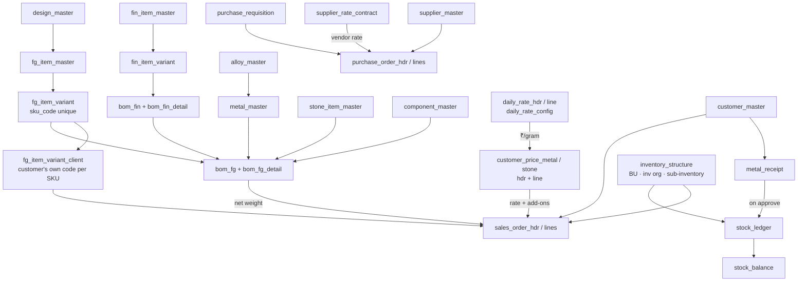
*Fig 12 — 63 Prisma models; the ones that carry business meaning are shown.*

Alongside sit the system tables: `user_master`, `role_master`, `user_role`, `menu_master`,
`role_menu_mapping`, `user_menu_mapping`, `master_lookup`, `project_config`, `erp_settings`,
`audit_log`, `system_error_log`, `login_history`, and the four `wf_*` workflow tables.

---

## 14. Item → variant → BOM

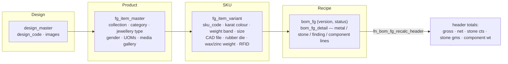
*Fig 13 — Findings mirror this exactly with `fin_item_master` → `fin_item_variant` → `bom_fin`, and
a finding BOM can be a line of an FG BOM.*

> **Rule — the database owns BOM totals.** `fn_bom_fg_recalc_header(bom_id)` and
> `fn_bom_fin_recalc_header(bom_id)` sum the active detail rows and overwrite the header; every write
> path calls the right one inside the same transaction. Whatever totals a request body claims are
> immediately superseded — verified by sending `gross_weight: 99999` with real detail lines and
> getting the correct figure back. If you add another place that writes BOM detail rows, call the
> function; do not sum in JavaScript.

---

## 15. BOM lifecycle & RFC versioning

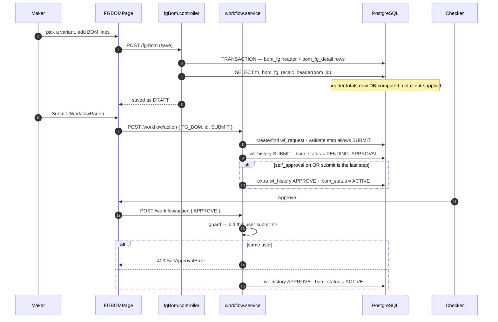
*Fig 14 — Only an ACTIVE BOM's weights are read by the Sales Order and purchasing LOVs.*

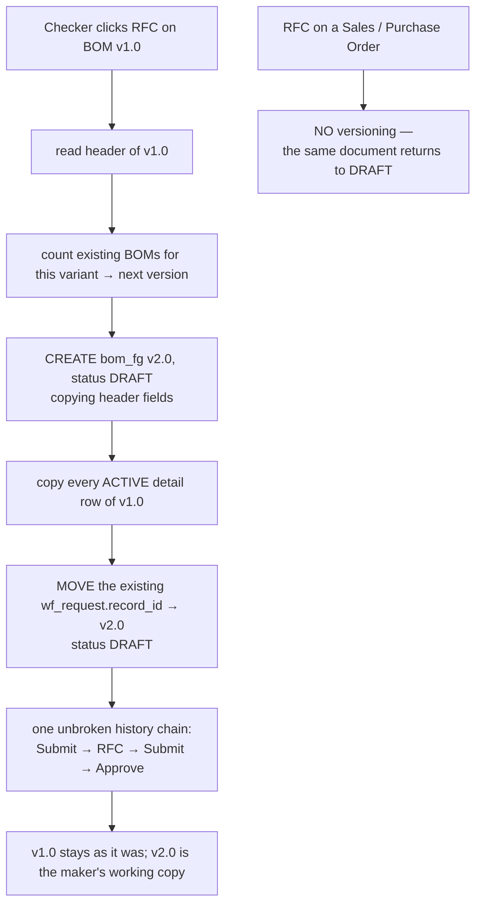
*Fig 15 — Without the `wf_request` transfer at step F, the new BOM's first Submit would create a
separate request and the earlier history would be orphaned.*

---

## 16. Bulk import

FG Master and Finding Master both have a three-sheet Excel importer. The interesting property is its
failure granularity: **one transaction per product**, not one per file.

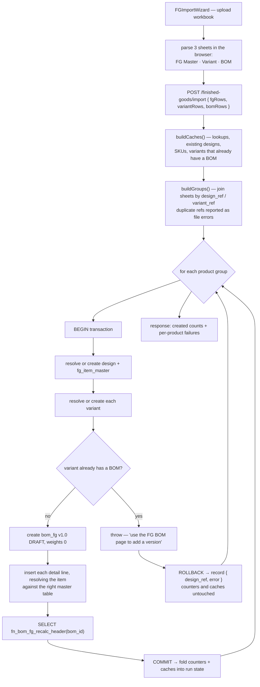
*Fig 16 — Local counters are merged into shared state only after the commit, so a rolled-back
product never pollutes the totals or the in-memory caches.*

Imported BOMs land as `DRAFT` v1.0 — they still go through the workflow (§15) before anything can
price against them.

---

## 17. Lookups & LOVs

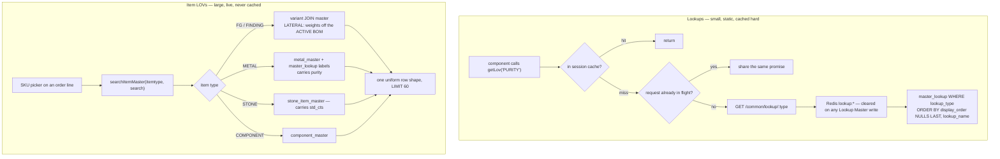
*Fig 17 — Lookups are cached twice over (browser session and Redis); item LOVs are searched live and
capped at 60 rows.*

`master_lookup` is the generic dropdown table keyed by `lookup_type` — purity, karat colour, payment
term, UOM, metal type, inventory org and dozens more. **Adding a dropdown value is a Lookup Master
edit, not a code change.**

`ITEM_TYPES` in `itemLov.service.ts` is deliberately a TypeScript enum rather than a lookup type: it
is kept in step with the `chk_pr_itemtype` and `chk_po_line_itemtype` CHECK constraints, and a value
added without a matching query branch would be a picker with nowhere to look.

---

## 18. Party masters

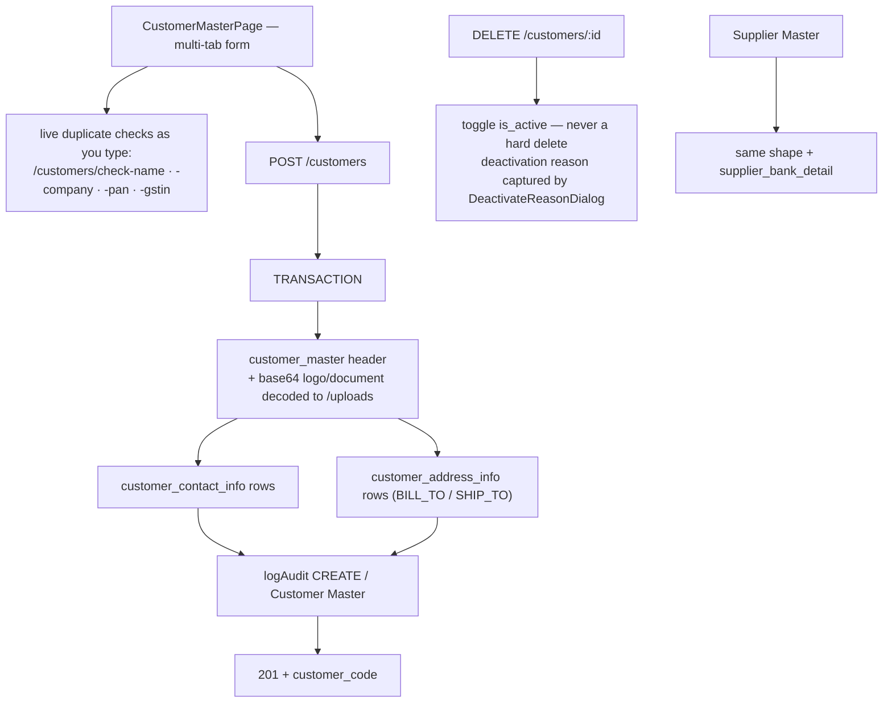
*Fig 18 — Deactivation is always a soft toggle with a captured reason; orders reference these rows.*

The duplicate-check endpoints are separate from the save so the form can warn while the user is still
typing rather than failing on submit. Files arrive as base64 data URIs in the JSON body and are
decoded to disk under `api/uploads/`.

---

## 19. Daily Rate

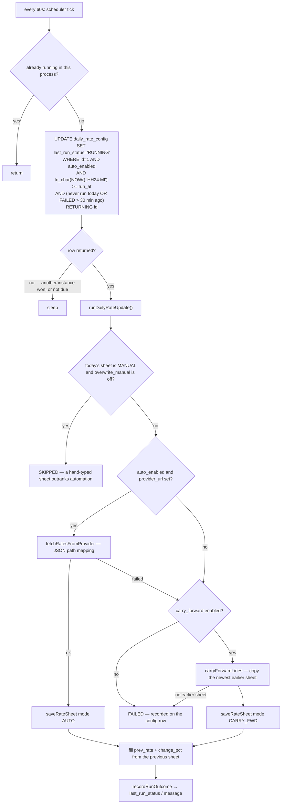
*Fig 19 — The claim query is the distributed lock; the database is the only clock and the only mutex,
so behaviour is identical on one instance or three.*

A dead feed degrades to a stale-but-usable rate rather than no rate. A failed run retries after 30
minutes. `DAILY_RATE_SCHEDULER=off` keeps one process out of the rotation without touching the
business-owned `auto_enabled` switch.

On the read side, `resolvePricingRate()` returns the ₹/gram for the metal and purity named in
`daily_rate_config.pricing_metal_type` / `pricing_purity`, taken from the most recent active sheet
*on or before* today — so a missed day still prices. This replaced a hardcoded
`GOLD_RATE = 147500` constant.

---

# Part IV — Transactions

## 20. The workflow engine

| Table | Role |
|---|---|
| `wf_config` | One row per module (`module_code`), with the `self_approval` switch |
| `wf_step` | Ordered steps; each declares `can_submit` / `can_approve` / `can_reject` / `can_rfc`, an assigned role or user, and an `rfc_to_step` |
| `wf_request` | One row per document, unique on (`record_type`, `record_id`); holds `current_step` and `wf_status` |
| `wf_history` | Append-only audit of every action, who took it, their remarks |

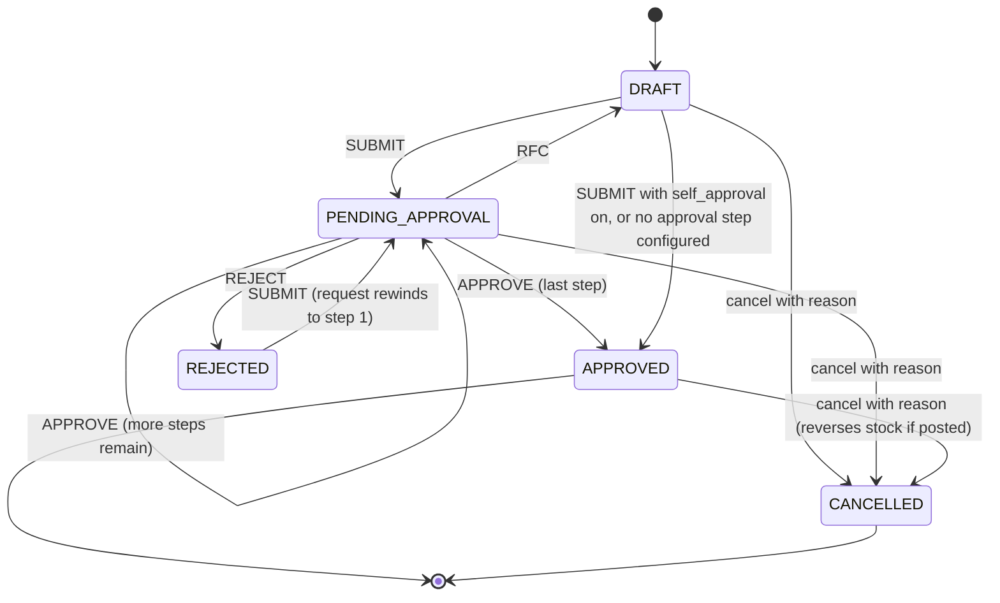
*Fig 20 — The document lifecycle (`ORDER_STATUS` / `BOM_STATUS`). The engine's own `WF_STATUS` is a
separate vocabulary that shares some spellings; the module hooks translate between them.*

```mermaid
flowchart TD
    A["runWorkflowAction({ recordType, recordId, action, userId })"] --> B["wf_config for module — orderBy id asc"]
    B -->|none| B2["throw 'No workflow configured'"]
    B --> C["load active wf_step rows"]
    C --> D["find wf_request by (record_type, record_id)"]
    D --> E{"APPROVE / REJECT / RFC ?"}
    E -->|yes| F{"last SUBMIT was by this user?"}
    F -->|yes| F2["SelfApprovalError → 403"]
    F -->|no| G
    E -->|no| G["BEGIN TRANSACTION"]
    G --> H{"wf_request exists?"}
    H -->|"no, and action is not SUBMIT"| H2["throw 'must SUBMIT first'"]
    H -->|no| H3["create wf_request at step 1"]
    H -->|yes| I
    H3 --> I{"SUBMIT while current step is not 1<br/>and document is DRAFT or REJECTED?"}
    I -->|yes| I2["rewind request to step 1"]
    I --> J{"step allows this action?"}
    J -->|no| J2["throw"]
    J -->|yes| K["compute new step + wf_status"]
    K --> L["UPDATE wf_request · INSERT wf_history"]
    L --> M["runModuleHook — sets the document's own status column"]
    M --> N{"SUBMIT and (self_approval or no next step)?"}
    N -->|yes| O["extra APPROVE history + status APPROVED<br/>+ run the APPROVE hook"]
    N -->|no| P
    O --> P{"hook returned rfc_new_bom_id?"}
    P -->|yes| Q["move wf_request.record_id to the new BOM"]
    P -->|no| R["COMMIT"]
    Q --> R
```
*Fig 21 — Every branch runs inside one transaction with its module hook, so document status and
workflow state can never diverge.*

### Module hooks

| record_type | What the hook does |
|---|---|
| `FG_BOM`, `FINDING_BOM` | Sets `bom_status`, stamps submitted/approved/rejected by-and-at. RFC clones a new DRAFT version and transfers the request. |
| `SALES_ORDER` | Sets `order_status` on the header and cascades `item_status` to every line. |
| `PURCHASE_ORDER` | Sets `po_status` and cascades `line_status`. |
| `METAL_RECEIPT` | Sets `receipt_status`, and **on APPROVE only** posts stock — but only if a destination sub-inventory was chosen. |

> **Rule.** Never set a document's status column directly. Call `runWorkflowAction()`. A direct
> `UPDATE` leaves the document and its `wf_request` permanently out of step, and the record becomes
> unactionable from the workflow panel.

`WorkflowPanel.tsx` reads `GET /workflow/panel/:recordType/:recordId`, which orders its config lookup
identically to the engine (`orderBy id asc`) — if a module ever had two active configs, a panel
reading a different row would offer actions the engine refuses.

---

## 21. Sales Order

```mermaid
sequenceDiagram
    autonumber
    participant U as Sales user
    participant P as SalesOrderPage
    participant API as salesOrder.controller
    participant DR as dailyRate.service
    participant WF as workflow.service
    participant DB as PostgreSQL

    U->>P: pick Business Unit, Customer, Order Type
    P->>API: GET /sales-orders/inventory-structure/:bu
    API-->>P: inv org + sub-inventory options for that BU

    U->>P: add a line, search a SKU
    P->>API: GET /sales-orders/lov/fg?search=&customer=
    Note over API: LATERAL prefers this customer's client-variant row
    API-->>P: sku · karat · weight band · lead time ·<br/>customer item · sales group

    P->>API: GET /sales-orders/item-price?sku&customer_id&gold_rate
    API->>DR: resolvePricingRate()
    DR-->>API: ₹/gram from the latest sheet on or before today
    API->>DB: customer price line + ACTIVE BOM net weight
    API-->>P: unit price + the whole breakdown

    U->>P: Save Draft or Save & Submit
    P->>API: POST /sales-orders { action }
    API->>API: parseOrderBody — always parses to DRAFT
    API->>DB: TRANSACTION — sales_order_hdr + sales_order_lines
    alt action = submit
        API->>WF: runWorkflowAction(SALES_ORDER, SUBMIT)
        alt submit fails
            API-->>P: "saved as draft — could not submit: …"<br/>the draft is NOT unwound
        else
            WF->>DB: order_status = PENDING_APPROVAL, lines follow
        end
    end
    API->>DB: logAudit CREATE / Sales Order
```
*Fig 22 — "Save & Submit" writes the draft first and then runs the workflow; a submit failure leaves
a usable draft rather than losing the order.*

```mermaid
flowchart TD
    S["GET /sales-orders/item-price"] --> R{"line has its own Gold Rate?"}
    R -->|yes| RATE["use the negotiated rate"]
    R -->|no| DRR["resolvePricingRate() from Daily Rate"]
    DRR -->|"no sheet on file"| MISS["rate_missing — percentage lines have no price,<br/>amount lines still price"]
    RATE --> CP
    DRR --> CP["read the customer's price line for this SKU<br/>(FG under 'FG', findings under 'FINDING')"]
    CP --> NW["net weight = ACTIVE BOM header<br/>(no ACTIVE BOM → 0, weight term drops out)"]
    NW --> M{"rate_basis × rate_type"}
    M -->|"Per Weight + %"| F1["DAILY_RATE × rate% × NETWT"]
    M -->|"Per Pc + %"| F2["DAILY_RATE × rate%"]
    M -->|"Per Weight + Amount"| F3["rate × NETWT"]
    M -->|"Per Pc + Amount"| F4["rate × 1"]
    F1 & F2 & F3 & F4 --> AD["+ add-ons: rhodium · tricolour rhodium ·<br/>lobster · silky rope · hallmark"]
    AD --> OUT["unit price + full breakdown returned<br/>so the screen can show its working"]
```
*Fig 23 — The rate used is stored on the line: a reopened order explains its own price rather than
today's.*

Editing is permitted only in `DRAFT` or `REJECTED` (`ORDER_EDITABLE`) — a rejected order is editable
because that is how the maker fixes it and sends it back round. Cancelling sets `CANCELLED` on the
header and every line, with a reason, and is never a delete.

An order line needs an item and a positive quantity *even on a draft*: a half-filled line is no more
useful persisted than rejected, and the screen enforces the same rules on Save Draft.

---

## 22. Requisition → Purchase Order

```mermaid
flowchart TD
    A["Purchase Requisition — one item per requisition"] --> B["saved with is_active = TRUE"]
    B --> C{"buyer opens Purchase Order"}
    C --> D1["Requisition Number picker<br/>GET /purchase-orders/lov/requisitions"]
    C --> D2["Pending Requisition tab<br/>GET /purchase-orders/requisitions/pending"]
    D1 & D2 --> E["same open-requisition predicate:<br/>NOT EXISTS (a PO line with this req_number<br/>on a PO whose status ≠ CANCELLED)"]
    E --> F["so the same demand is never ordered twice<br/>by two buyers working the same list"]
    F --> G["exclude_po names the PO being edited,<br/>so its own lines don't hide their requisitions"]
    G --> H["selected requisitions become PO lines"]
    H --> I["GET /purchase-orders/item-rate per line"]
    I --> J["supplier_rate_contract for (vendor, itemtype, sku)"]
    J --> K{"exact SKU row or 'ALL' catch-all?"}
    K -->|both exist| K1["exact SKU wins"]
    K -->|neither| K2["rate_found false — buyer types a one-off price"]
    K1 --> L{"rate_basis"}
    L -->|PER_GM| L1["rate × line net weight"]
    L -->|PER_PC| L2["rate × 1"]
    L1 & L2 --> M["Save Draft or Save & Submit → workflow"]
```
*Fig 24 — The `NOT EXISTS` predicate is the only thing preventing double-ordering, and it is
duplicated in two endpoints that must stay identical.*

The SKU picker on both documents is the shared `searchItemMaster` (§17), so a requisition can never
be raised for an item its own purchase order cannot find. Supplier defaults (currency, payment term,
addresses) come from `GET /purchase-orders/suppliers/:id/defaults`.

Note the symmetry: the Sales Order reads Customer Price Master, the Purchase Order reads Supplier
Rate Contract, and both use the same "exact row beats catch-all" precedence.

---

## 23. Metal Receipt → stock

```mermaid
sequenceDiagram
    autonumber
    participant U as Store user
    participant P as MetalReceiptPage
    participant API as metalReceipt.controller
    participant WF as workflow.service
    participant ST as stock.service
    participant DB as PostgreSQL

    U->>P: customer, metal SKU, weights, destination sub-inventory
    P->>API: POST /metal-receipts { action }
    API->>API: received weight must be positive; pure weight<br/>non-negative and never above received weight
    Note over API: mirrors the chk_mr_* CHECK constraints —<br/>pure above received means 916 was typed for 0.916
    API->>DB: INSERT metal_receipt (DRAFT)
    opt action = submit
        API->>WF: runWorkflowAction(METAL_RECEIPT, SUBMIT)
    end

    U->>P: Approve (checker)
    P->>WF: POST /workflow/action { APPROVE }
    WF->>DB: receipt_status = APPROVED
    alt inward_sub_inv is set
        WF->>ST: postStockMovement(tx, RECEIPT …)
        ST->>DB: INSERT stock_ledger (+quantity, +pure)
        ST->>DB: UPSERT stock_balance — increment
    else no destination chosen
        Note over WF: left un-posted rather than guessing a location
    end

    U->>P: Cancel with reason
    P->>API: DELETE /metal-receipts/:id
    API->>DB: TRANSACTION — receipt_status = CANCELLED
    alt was APPROVED
        API->>ST: reverseStockMovement(tx …)
        ST->>DB: INSERT stock_ledger REVERSAL (negated,<br/>reverses_ledger_id → the original)
        ST->>DB: UPSERT stock_balance — decrement
    else never approved
        Note over ST: no-op — nothing was ever posted
    end
```
*Fig 25 — Stock moves at approval, not at save, and is backed out by a new negated row rather than by
editing or deleting the original.*

---

## 24. Stock posting

```mermaid
flowchart TD
    subgraph callers["Callers — all must go through the service"]
        MR["Metal Receipt approve / cancel — live today"]
        FUT["BOM issue · Sales dispatch · PO receipt — designed next"]
    end
    MR --> PS
    FUT -.-> PS
    PS["postStockMovement(tx, input)"] --> L["INSERT stock_ledger<br/>signed quantity: + in, − out<br/>txn_type · source_module · source_id"]
    L --> B["UPSERT stock_balance<br/>key: (sub_inv_code, sku_code, uid)"]
    B --> B1{"row exists?"}
    B1 -->|no| B2["create with the quantity"]
    B1 -->|yes| B3["increment quantity and pure_quantity<br/>set last_ledger_id"]

    RV["reverseStockMovement(tx, { sourceModule, sourceId })"] --> RV1["find newest ledger row for that source<br/>with reverses_ledger_id IS NULL"]
    RV1 -->|"none found"| RV2["return null — caller decides if that's an error"]
    RV1 --> RV3["re-post with every quantity negated,<br/>reverses_ledger_id → the original"]
    RV3 --> PS

    B2 & B3 --> RD["OnHandStockPage reads stock_balance<br/>GET /stock/balance — read-only by design"]
```
*Fig 26 — The single write path. `stock_balance.uid` is `NOT NULL DEFAULT ''` so blank/untagged lots
pool into one balance row.*

Transaction types: `RECEIPT`, `ISSUE`, `REVERSAL`, `ADJUSTMENT`, `TRANSFER_IN`, `TRANSFER_OUT`.
Always called with a caller-supplied transaction, so the ledger write and the document's status
change commit or roll back together.

**Never write either table directly.** The moment "sum the ledger" and "trust the balance" have two
code paths they drift, and the difference is real inventory.

---

# Part V — Operations

## 25. Logging, mail & cache

```mermaid
flowchart LR
    subgraph write["Write paths — never block the user"]
        C["controller"] -->|"logAudit(...)"| SI1["setImmediate"]
        C -->|"logError(...)"| SI2["setImmediate"]
        RL["rate limiter breach"] --> SI2
        SI1 --> AL["audit_log<br/>who · module · action · record · old/new values · IP"]
        SI2 --> EL["system_error_log<br/>severity · type · message · stack · path · IP"]
        LOGIN["auth.service"] --> LH["login_history — success and failure, with reason"]
    end
    subgraph read["Settings screens"]
        AL --> S1["Audit Logs"]
        EL --> S2["Error Logs"]
        LH --> S3["User Login Logs"]
    end
    NOTE["both helpers swallow their own errors —<br/>a failed audit write must not fail the user's action"]
```
*Fig 27 — Module labels come from `constants/auditModules.ts` so `"Supplier Master"` cannot silently
become `"Supplier master"`.*

### Mail

Credentials are **not** environment variables. `loadMailConfig()` reads every `project_config` row
with a `mail_%` key and builds a nodemailer transport from it, which is what the Mail Configuration
settings screen edits. Sends are retried three times (2 s / 4 s / 8 s). The `SMTP_*` variables still
present in `.env.example` and `docker-compose.yml` are leftovers.

### Redis — optional, always fail-open

| Cached | Key | Invalidation |
|---|---|---|
| Lookup LOVs | `lookup:*` | Whole namespace cleared on any Lookup Master write |
| Menu tree + permission map | `menu:tree:*`, `menu:perm:*` | Per user — see Fig 10 |
| Rate-limit counters | — | TTL; survives restarts, shared across replicas |

The client fails *fast* as well as open: `enableOfflineQueue: false` makes commands reject
immediately while disconnected rather than stalling for the reconnect backoff. Errors are logged at
most once a minute. `passOnStoreError: true` makes a Redis outage a rate-limiting no-op, not a 500.
Rate limiting is skipped entirely when `NODE_ENV !== 'production'`.

### Secrets & uploads

With `GCP_PROJECT_ID` set, `DB_PASSWORD` and `JWT_SECRET` come from GCP Secret Manager at startup
(Fig 2) via Application Default Credentials — no key file. A failed fetch degrades to "acts as if
unset", never to a crash.

Uploads are served from `/uploads` with `Cross-Origin-Resource-Policy: cross-origin` — Helmet's
same-origin default would block an image served on `:5000` from loading into a page served on `:80`.
Body limits are path-scoped: 70 MB parsers registered ahead of the generic 10 MB one for the two
document/media routes.

---

## 26. Schema history

**`api/prisma/migrations/` is the single authoritative schema history.** Every change goes through
`npx prisma migrate dev`. Do not hand-write ad-hoc SQL.

The project once tracked schema two ways at once — a handful of Prisma migrations *and* ~115
hand-numbered SQL scripts. An audit found the Prisma history was missing 19 of the schema's 48 tables
entirely. In July 2026 a single migration, `20260716000001_baseline_reconciled_schema`, was generated
from the live database's actual structure and replaced that history, verified by running it alone
against a blank database and by a column-, index- and constraint-level diff.

| Directory | Status |
|---|---|
| `prisma/migrations/` | **Authoritative** — baseline + ~34 incrementals |
| `prisma/migrations_archive/` | Reference — the superseded 12-migration history |
| `database/scripts/` | Historical — ~115 numbered scripts, applied nowhere |
| `schema_pulled.prisma` | Snapshot — root-level introspection artifact |

> **Deploying to an existing environment.** Dev and UAT already have these tables. Do **not** run the
> baseline there — mark it applied:
> `npx prisma migrate resolve --applied 20260716000001_baseline_reconciled_schema`.

---

## 27. Deployment

`docker-compose.yml` brings up three services against an **external** PostgreSQL:

- **redis** — `redis:7-alpine`, 256 MB cap, `allkeys-lru`.
- **api** — built from `api/Dockerfile`, on `:5000`. Named volumes for `uploads` and `logs`.
- **app** — Vite build baked at image-build time (`VITE_*` are build args), served by Nginx on `:80`.

Because the frontend's configuration is compiled in, changing `VITE_API_BASE_URL` or
`VITE_UPLOADS_BASE_URL` requires a rebuild — not a restart.

### Production checklist

- `JWT_SECRET` — long and random; the server refuses to start without it.
- `DB_SSL=true`.
- `NODE_ENV=production` — this also switches rate limiting *on* and error detail *off*.
- `CORS_ORIGIN` — comma-separated allowed origins; an unlisted origin is rejected.
- Change every seeded password. `EMP001`/`EMP002`/`EMP003` all ship as `Admin@123`.
- Optionally `GCP_PROJECT_ID`, after creating the two secrets and granting the VM's service account
  `roles/secretmanager.secretAccessor`.

---

## 28. Recipe: adding a screen end to end

### Database

1. **Schema.** `npx prisma migrate dev --name your_change`, then `npx prisma generate`.
2. **Menu row** in `menu_master` — `menu_code` (the permission identifier), `menu_url`, `parent_id`,
   order, icon. *Skip it and the screen has no way to be opened.*
3. **Role permissions** — `role_menu_mapping` rows for every role that should reach it. *Skip it and
   the menu appears for everyone but the API 403s (§10).*
4. **Lookups** — any new `master_lookup` types/values.

### Backend

5. **Pick a style (§6).** New modules use Style C.
6. **Controller** — validate explicitly, return through `sendSuccess`/`sendError`, and `logAudit`
   with a label from `constants/auditModules.ts` on every write.
7. **Router** with `const MENU = 'YOUR_MENU_CODE'` and `validateToken, requirePermission(MENU,
   action)` per line. Put literal sub-paths (`/lov/:x`, `/stats`) **above** `/:id`.
8. **Mount** in `routes/index.ts`.
9. **If it needs approval** — a `wf_config` row, its `wf_step` rows, and a branch in `runModuleHook`.
10. **If it moves stock** — call `postStockMovement` inside the same transaction.

### Frontend

11. **Page component** in `pages/<module>/`. Start from a sibling page of similar shape.
12. **Register it twice** — `AppRoutes.tsx` and `routeRegistry.ts` (Fig 11).
13. **Gate the UI** with `usePermission('YOUR_MENU_CODE')`.
14. **Dropdowns** through `getLov()`, not a direct lookup call.
15. **Clean up effects** — the page stays mounted in a background tab.

### Verify

Sign in as a role that *should not* have the screen and confirm it is absent; sign in as one that
should and exercise create, update and delete. Check the row appeared in Audit Logs. If you edited
`project_config` for a Style B module, flush the query cache.

---

## 29. Traps

| Symptom | Cause |
|---|---|
| Tab opens blank | Page missing from `routeRegistry.ts` |
| Navigating redirects home | Page missing from `AppRoutes.tsx`, or you typed the URL directly (no open tab) |
| Menu visible but the page 403s | No `role_menu_mapping` row — sidebar defaults to visible, the API defaults to denied |
| Permission change has no effect | 5-minute Redis cache not invalidated for that user/role |
| "API method not configured" | Missing or inactive `project_config` row for that `key_code` |
| Edited `project_config`, nothing changed | Style B module — cached indefinitely in-process; `POST /settings/query-cache/flush` |
| Paginated grid always shows one page | No `<method>_count` companion row, so `total` silently falls back to the page size |
| Migrations fail on a blank DB | Expected — follow Fig 3's order |
| Prisma CLI hits the wrong database | The CLI reads `api/.env`; the running API reads `api/.env.local` |
| `JSON.stringify` throws on BigInt / numbers serialise as `{s,e,d}` | Bypassed `sendSuccess` with a raw `res.json()` |
| BOM header totals disagree with lines | Something wrote detail rows without calling `fn_bom_*_recalc_header` |
| Document unactionable in the workflow panel | Its status column was set directly instead of through `runWorkflowAction` |
| Stock balance disagrees with the ledger | Something wrote a stock table directly instead of via `postStockMovement` |
| Approved receipt posted nothing | No `inward_sub_inv` chosen — deliberately un-posted rather than guessed |
| Same requisition ordered twice | The `NOT EXISTS` predicate is duplicated in two endpoints; they must stay identical |
| Sales line has no price | Percentage-priced with no Daily Rate sheet on file — `rate_missing`; type a Gold Rate on the line |
| Mail settings in `.env` ignored | Mail config is read from `project_config` rows, not env vars |
| Logged out on every deploy | Would be a regression — `fetchProfileAsync` intentionally distinguishes 401/403 from network failure |
| Route `/lov/x` resolves as an id | Literal sub-path declared below `/:id` in the router |
| Prettier reformats the whole file | Ran it from the wrong package — `app` has no semicolons, `api` does |

---

## 30. Gaps & where risk sits

### Documentation drift

`README.md`'s API section is stale in three ways: an `api_key` field that exists nowhere in the
source, common endpoints listed as `GET` when they are `POST`/`PUT`/`DELETE`, and a feature list
naming screens (Party Master, Category Master, Product Master, Sales Report) superseded by the
current masters. `LOCAL_SETUP.md` is accurate. Treat the routers and controllers as the
specification.

### Structural

- **Three data-access styles coexist.** "How do I add a list endpoint" has three answers. New work
  should converge on Style C.
- **Two connection pools.** `pg` and Prisma cannot share a transaction.
- **Very large page components.** Several exceed 2,000 lines, two exceed 3,000. Shared logic is
  duplicated between siblings rather than extracted, so a cross-cutting fix often needs applying in
  several places — the current branch's 47-file diff is an example.
- **The permission default mismatch** (§10) is a real inconsistency, not a convention.
- **Duplicated predicates.** The open-requisition `NOT EXISTS` is written twice, in the picker and
  the pending grid. They must agree or demand leaks.

### Operational

- **No automated test suite.** Neither package has a test script; Playwright is in `app`'s
  devDependencies but unused. Verification is manual.
- **Local database has no business data.** Only system/configuration data was recoverable, so every
  grid opens empty.
- **GCP Secret Manager is unverified against a real project.** Only the fallback and failure paths
  were confirmed.
- **`user_menu_mapping` is empty locally**, so the per-user override path is untested locally.

### Incomplete modules

Menus exist for Production Management (scheduling, re-scheduling, process), Quality (incoming,
in-process, pre-dispatch), Integration (AP, AR, customer, vendor, portal), Reports, Costing, Capacity
Master, Work Definition and Blanket Agreements. These land on the Under Construction page — the
catch-all route inside the admin shell renders it rather than redirecting, which is why an unbuilt
menu item looks deliberate rather than broken.

On the stock side, only Metal Receipt posts movements today. BOM issue, sales dispatch and PO receipt
are the designed next callers of `postStockMovement` (Fig 26).
